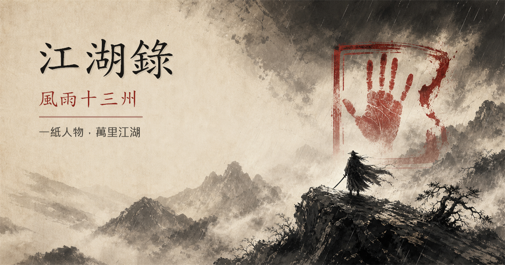

<p align="center">
  
</p>

# 江湖錄：風雨十三州

一款原創、繁體中文、可直接在瀏覽器遊玩的武俠 TRPG。玩家加入八個門派之一，另選一種可自由搭配的武功派系，以一黑一白兩顆六面骰行走十三州。

**[▶ 直接開始遊玩](https://allenyuu.github.io/jianghu-chronicles/)**

## 這是一款怎樣的遊戲？

天子久病，八門共守的「山河盟誓」一夜焚毀。灰燼裡出現一枚不屬於八門的第九方掌印；角色因一封借自己姓名殺人的血書，被推進十三回的江湖疑局。

- 可單人遊玩完整的十三回主線，也支援 2–6 人有主持／無主持團務。
- 以「陰陽雙骰」同時判定成敗與氣向：陰高回息、陽高生勢、同點和合升階。
- 八個原創門派，各有山門、戒律、盟友、宿敵、門派債與四式傳承。
- 七種武功派系可跨門派搭配：劍脈、刀宗、拳掌、身法、內家、奇門、醫毒。
- 共 42 式武學、12 個可重玩的江湖場景、3 場章回首領戰。
- 角色建立、擲骰、戰鬥、升境、傷痕、日誌與本機自動存檔皆已內建。
- 另附掌門錦囊：江湖局、NPC、真假傳聞、天意骰、通用骰與六格局勢鐘。

## 一分鐘規則

當結果不確定而且成敗都有意義時，擲一黑一白兩顆 D6，加上一項屬性：

| 總和 | 結果 | 意義 |
| --- | --- | --- |
| 12+ | 傳奇 | 完整成功，另得超出預期的好處 |
| 9–11 | 得手 | 完整達成宣告的目的 |
| 6–8 | 兩難 | 達成主要目的，但承擔傷勢、耗損或艱難選擇 |
| 5- | 失手 | 局勢惡化，但角色仍獲得修為 |

再比較兩顆骰：

- 陰骰較高：回復 1 內息；若已滿，得到一條細微線索。
- 陽骰較高：獲得 1 氣勢；擲骰前可燃燒 1 氣勢，使總和 +2。
- 陰陽同點：觸發「和合」，把當前結果提升一階。

完整桌上規則見 [快速上桌規則](docs/QUICKSTART.md)，可直接主持的開局劇本見 [〈借名血書〉](docs/ADVENTURE.md)。

## 八門與七脈

| 門派 | 長處 | 門派債 | 鎮派武學 |
| --- | --- | --- | --- |
| 棲霞劍閣 | 問心正劍 | 不得向求救者背身 | 流霞十三劍 |
| 鐵衣門 | 外家護守 | 不得棄同伴於身後 | 百鍊鐵衣功 |
| 聽雨樓 | 情報暗器 | 每個秘密都有應付的價錢 | 驟雨無聲針 |
| 百草谷 | 醫術毒理 | 見死不救者須記其姓名 | 逆脈回春手 |
| 逐浪幫 | 水路快刀 | 同舟者必須同岸 | 九折潮生步 |
| 無相禪院 | 掌法內功 | 殺意一起，先問三息 | 無相印 |
| 寒星宮 | 軟劍寒功 | 不可在外人前示弱 | 星墜十三點 |
| 天機坊 | 機關陣法 | 所造之器不可交給昏主 | 天機鎖龍 |

門派是角色的江湖身份與因果；武功派系是角色解決問題的手法。兩者不綁定，因此可以建立修醫毒的鐵衣門人、走刀宗的棲霞弟子，或以身法為主的天機坊匠師。

## 本機執行

本專案沒有第三方執行相依，Node.js 只用於本機伺服器、測試與建置。

```bash
npm run dev
```

預設開啟 `http://127.0.0.1:4173`。

```bash
npm test
npm run build
```

建置成果位於 `dist/`。推送到 `main` 後，內附的 GitHub Actions 工作流程會測試、建置並發佈至 GitHub Pages。

## 設計參考與原創界線

本作研究了幾款同類作品的公開官方介紹，借鑑的是類型節奏與產品層級的設計方向，不使用其受版權保護的文字、規則表述、人物、門派、招式或世界設定：

- [Righteous Blood, Ruthless Blades](https://www.ospreypublishing.com/us/righteous-blood-ruthless-blades-9781472839367/)：重視江湖疑案、鮮明俠客與快速而有後果的交鋒。
- [Wandering Heroes of Ogre Gate](https://studio2publishing.com/products/wandering-heroes-of-ogre-gate)：以豐富門派與武學技法塑造完整武俠世界。
- [Feng Shui 2](https://www.atlas-games.com/product_tables/AG4020)：鼓勵動作描述、快速上手角色與電影感戰鬥。

《江湖錄》的陰陽雙骰、五項屬性、八門、七派系、42 式武學、第九印主線、所有場景與文案均為本專案原創。進一步的比較與取捨見 [設計筆記](docs/DESIGN_NOTES.md)。

## 專案結構

```text
.
├─ index.html             # 單頁遊戲介面
├─ styles.css             # 響應式水墨視覺系統
├─ data.js                # 門派、武學、場景、敵人與生成表
├─ app.js                 # 角色、擲骰、戰鬥、存檔與 GM 工具
├─ docs/
│  ├─ QUICKSTART.md       # 完整桌上快速規則
│  ├─ ADVENTURE.md        # 可直接主持的開局劇本
│  └─ DESIGN_NOTES.md     # 參考研究與原創設計說明
└─ .github/workflows/     # GitHub Pages 自動發佈
```

## 授權

程式碼、規則文字、世界設定與原創素材以 [MIT License](LICENSE) 開放。歡迎改造、翻譯、增添門派或自製劇本；保留授權聲明即可。

